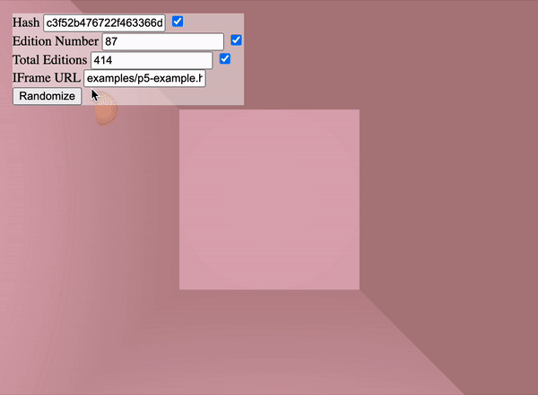

# verse generative example

## Introduction

This repository demostrates an example code for generative project of how to access hash and other parameters such as edition number and total number of editions.

## Playground



To test your project with different parameters you can open `playground.html` and provide your *IFrame URL*. This file may be locally on your computer or online.

We will be improving playground as we go to add new variables and examples.

## Instructions

Verse system will need to hash and other parameters to your project's  
`index.html` during minting. To allow your code accept these parameters you should include following `js` code. You can now continue using

```js
// Parse payload from query params
const payload = JSON.parse(decodeURIComponent(atob(new URLSearchParams(window.location.search).get("payload") || "")))

// Use available payload variables in your code
const hash = payload.hash
const editionNumber = payload.editionNumber
const totalEditions = payload.totalEditions
```

After that you can use Playground to test.